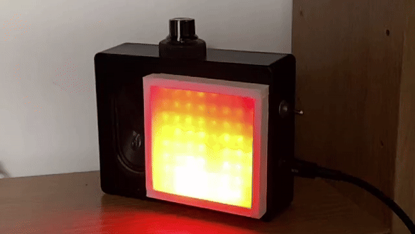
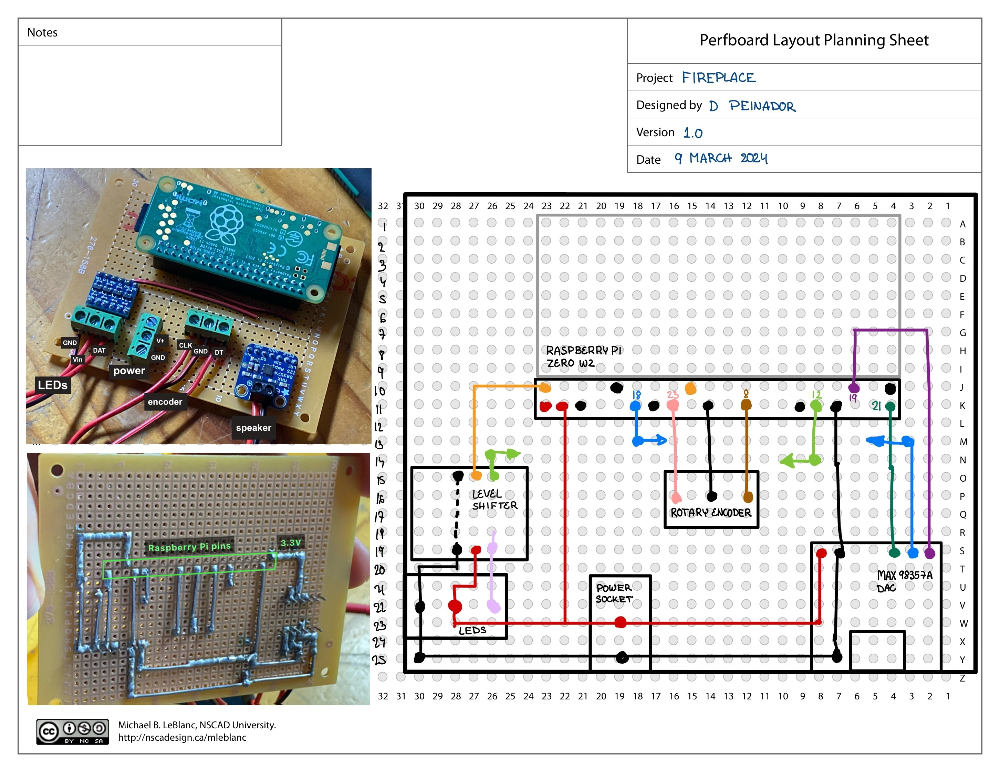

# Fireplace 🔥

Who doesn't like the soft flickering light and crackling sounds of a fireplace? The fire brigade and my landlord.

Fireplace is a Python package to run a fireplace animation in a Raspberry Pi Zero W2.
It displays a flame animation on an 8x8 ws2812 LED (neopixel) display.
It also sends audio output to a speaker connected to the Pi (I2S encoding).
Additionally, a rotary encoder provides control over the intensity of the LEDs and speaker volume.

  

## Installation
To install the package run:
```
pip install -e .
```
Before running the animations a couple of things need to be done:
1. Add audio files (MP3 or WAV) in `data/audio_files/`. You might need to create the directory if it does not exist. A collection of free fireplace sounds can be found [here](https://www.freetousesounds.com/free-fireplace-sound-effects/).
2. Generate the noise image files by running `python fireplace/lights/generate_noise_files`. This creates a series of numpy files in `data/perlin_noise`.
3. Make sure that the audio output is configured as I2S; following the instructions in reference [1].
4. Raspberry Pi specific installs:
    ```bash
    # from reference [2] below
    # libraries to control neopixels
    sudo pip3 install rpi_ws281x adafruit-circuitpython-neopixel
    sudo python3 -m pip install --force-reinstall adafruit-blinka
    ```
    and
    ```bash
    # from reference [3] below
    # library to read GPIO pins
    sudo apt-get update
    sudo apt-get install python3-rpi.gpio
    ```

## Usage
To run the main animation file run:
```
sudo python fireplace/main.py
```

The launcher file launcher.sh can be used to set up a crontab automatic execution upon booting. 
This can be done by opening crontab
```
crontab -e
```
and adding the following line
```
@reboot sh /home/pi/fireplace/launcher.sh >/home/pi/logs/cronlog 2>&1
```
changing the directories accordingly. Make sure that the logs directory exists by doing `mkdir logs` where appropriate.

## Development
The [tests folder](/tests) includes scripts to independently test each of the simulation components: LEDs, audio and the rotary encoder readout. Note that some of the dependencies of the module can only be installed on a Raspberry Pi, so do not expect to be able to run the test scripts on your system.

The LED animation is created using Perlin noise. The process is explained in [this notebook](/docs/noise.ipynb). This notebook can run without the Raspberry Pi dependencies.

To help during development I wrote `send_files.sh`, which sends the contents of the package to the Raspberry Pi (except for the `.git` directory) over the SSH connection.
This avoids having to push and pull for every change. The script uses the default ssh credential for the raspberry pi. You will need to update them with your pi's name and user.

To copy the code to the Raspberry Pi using ssh use:
```bash
source send_files.sh
```
### Component List
- Raspberry Pi Zero W2 (+32GB microSD card)
- MAX98357A I2S 3W amplifier
- 3W 4 $\Omega$ speaker
- 20 mm Rotary encoder (without breakout board and resistors)
- 5V to 3.3V 4-way bidirectional level shifter (might also work without)
- 8x8 WS2812 LED (Neopixel) matrix
- On-On Miniature Toggle Switch
- USB-C Power connector mount
- 5cm x 7cm perforated PCB
- 159XXSSBK ABS enclosure 121 x 94 x 34
- Wire, block sockets, header sockets, soldering supplies.
- white card and wrapping paper used as a light diffuser
### Wiring
The wiring is represented in the following diagram:

The arrows on the diagram indicate the use of wire on the top side of the board, as opposed to solder connections.

The colours represent the following:

| Colour | Description| GPIO | 
| ---------- | ------------ | ------ | 
| Black   |  Ground | |
| Red   |  5V. It could be powered using the Pi's USB port directly on the block connector positioned in row 19. | 
| Orange   |  3.3V  |  |
| Light  Green| LED data at 3.3V | 12  |
| Lilac   |  LED data at 5V | |
| Salmon   |  CLK signal for the rotary encoder | 23| 
| Brown   |  DT signal for the rotary encoder |  8 |
| Purple   |  LRC signal for amplifier | 19 |
| Blue   |  BLCK signal for amplifier | 18 |
| Dark Green  | DIN signal for amplifier | 21 |


The Raspberry Pi is not directly soldered to the board. Instead, it has male header pins that are plugged into the female headers that are soldered to the board. This makes it easy to replace the Pi if needed or use it for other projects.


## Room for improvement
Some things could be improved, although there are no plans to do it:
- It takes a minute or two to start the simulation after powering the pi. This is due to the time it takes to boot the system
- The simulation is slow in the first minutes
- Better control over the iteration tim
- Better configurations management.
- The speaker makes a popping noise when booting the Pi. This is probably due to the I2S configuration, and the Adafruit article linked below has a troubleshooting appendix. However, it was not very annoying and it was useful for knowing when the pi had booted.
- The enclosure is rather tight. It would have been better to have an enclosure that was taller (bigger on its smaller axis). 
- Better LED simulation
    - Make it sound-reactive
    - Add additional effects, like additional flickering
- The rotary encoder misses some ticks. There was a tradeoff between de-bounding and missing ticks. Perhaps using additional pull-up resistors could have worked better than using the ones installed on the Pi.

The initial idea for this project was to also have a small water vaporiser (aka atomiser) connected to the Pi. The water vapour would create the illusion of smoke. However, the feature was discarded, partly because it would have significantly increased the complexity of the build in terms of dealing with waterproofing the component enclosure.

## References 
[1] [MAX98357A documentation](https://web.archive.org/web/20240106093728/https://learn.adafruit.com/adafruit-max98357-i2s-class-d-mono-amp)

[2] [Adafruit NeoPixels on Raspberry Pi](https://web.archive.org/web/20240215090728/https://learn.adafruit.com/neopixels-on-raspberry-pi/overview)

[3] [Rotary encoders tutorial](https://newbiely.com/tutorials/raspberry-pi/raspberry-pi-rotary-encoder)
